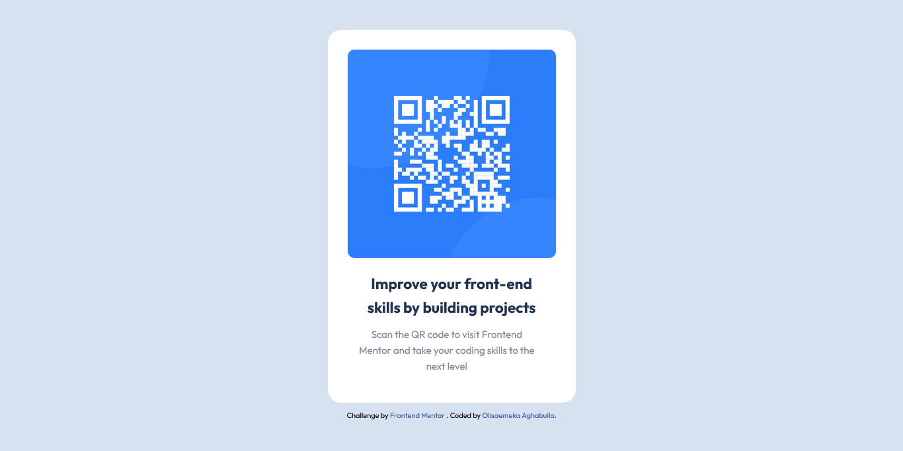

# Frontend Mentor - QR code component solution

This is a solution to the [QR code component challenge on Frontend Mentor](https://www.frontendmentor.io/challenges/qr-code-component-iux_sIO_H). Frontend Mentor challenges help you improve your coding skills by building realistic projects. 

## Table of contents

- [Overview](#overview)
  - [Screenshot](#screenshot)
  - [Links](#links)
- [My process](#my-process)
  - [Built with](#built-with)
- [Author](#author)
- [Acknowledgments](#acknowledgments)

## Overview

### Screenshot

### Links

- Solution URL: [GitHub](https://github.com/olisa187/qr-code-component)
- Live Site URL: [Add live site URL here](https://your-live-site-url.com)

## My process

### Built with

- Semantic HTML5 markup
- CSS custom properties
- desktop-first workflow

## Author

- Website - [Add your name here](https://www.your-site.com)
- Frontend Mentor - [@olisa187](https://www.frontendmentor.io/profile/olisa187)
- Twitter - [@olisa187](https://www.twitter.com/olisa187)

## Acknowledgments

I want to acknowlege frontendmentor for providing this project.
